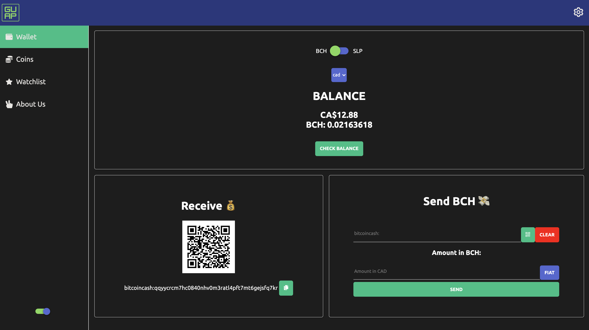
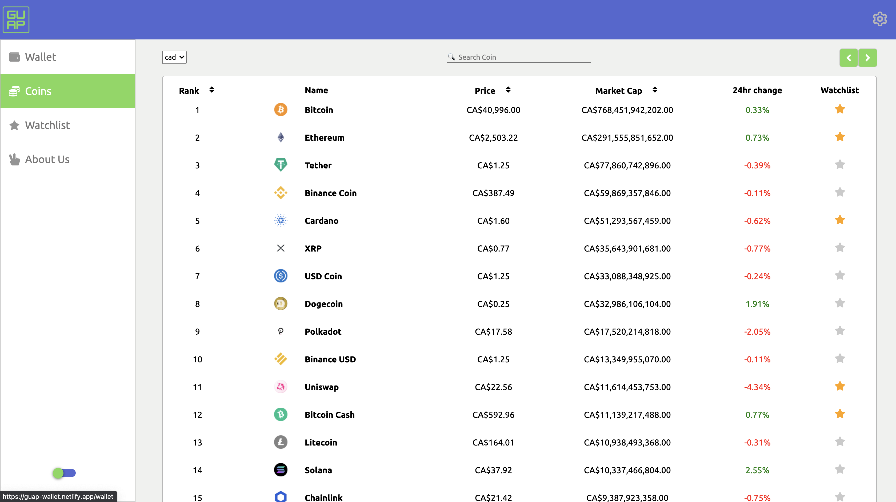
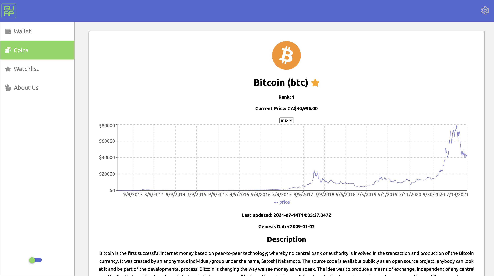
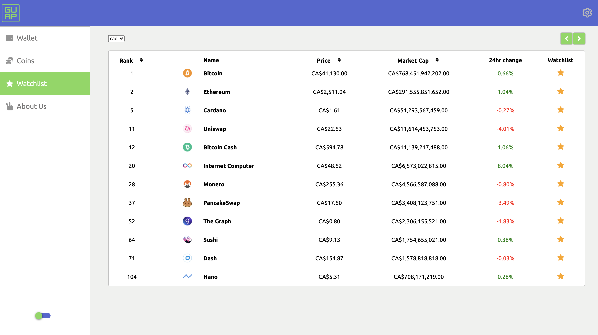

###### Project's Website: https://bit.ly/guap-wallet

Non-custodial cryptocurrency web wallet built on Bitcoin Cash mainnet. With the additional functionality such as keeping track of various cryptocurrency prices, adding certain coins to the watchlist and accessing more info by clicking on specific coin. 

## Contributors

- <a target="_blank" href="https://github.com/zaindewsi">Zain Dewsi</a>
- <a target="_blank" href="https://github.com/JettScythe">Jett Scythe</a>
- <a target="_blank" href="https://github.com/vitalyzaff">Vitaly Zavgorodnev</a>


## Tech Stack

- React.js
- Storybook
- Minimal-SLP-Wallet
- bch.js
- Recharts
- Sass

## App Features







## Setup


1. Fork and clone repo to your local machine.
2. Install dependencies with ```npm install```
3. Start the server using ```npm start``` command.
4. Browser window will open with the ```localhost:3000``` address.


##### Running Storybook Visual Testbed

```npm run stroybook```

## Dependencies

- @psf/bch-js: ^4.20.1,
- axios: ^0.21.1,
- coingecko-api: ^1.0.10,
- jwt-bch-lib: ^1.3.0,
- minimal-slp-wallet: ^3.3.3,
- qrcode.react: ^1.0.1,
- react: ^17.0.2,
- react-dom: ^17.0.2,
- react-icons: ^4.2.0,
- react-qr-reader: ^2.2.1,
- react-router: ^5.2.0,
- react-router-dom: ^5.2.0,
- react-scripts: 4.0.3,
- react-switch: ^6.0.0,
- react-toastify: ^7.0.4,
- recharts: ^2.0.9,
- sass: ^1.35.1,
- use-dark-mode: ^2.3.1,
- web-vitals: ^1.1.2